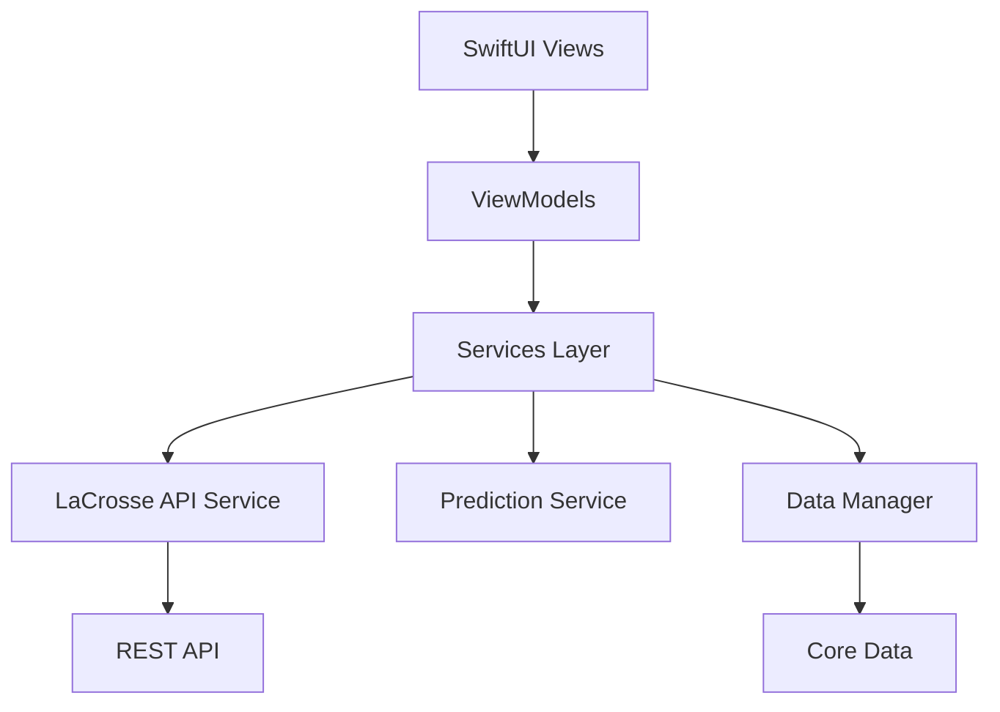

# LaCrosse Weather Station iOS App

A native iOS app built with SwiftUI that connects to your LaCrosse View weather station and provides intelligent short-term weather predictions for your backyard.

## Features

### 🌡️ Real-Time Weather Monitoring
- Live temperature, humidity, pressure, wind speed, and rainfall data
- Direct connection to LaCrosse View weather station via REST API
- Auto-refresh every 5 minutes
- Offline mode with cached data

### 📊 Smart Weather Predictions
- 1-6 hour forecasts based on sensor trend analysis
- Confidence scoring for prediction accuracy
- Temperature, humidity, and precipitation probability predictions
- Trend indicators (rising, falling, stable)

### 📱 Beautiful SwiftUI Interface
- Clean, modern dashboard with current conditions
- Interactive charts for temperature, pressure, and humidity trends
- Hourly forecast cards with weather icons
- Dark mode support
- Accessibility features (VoiceOver, Dynamic Type)

### 💾 Data Management
- Historical data storage with Core Data
- 7-day data retention
- Export data to CSV
- Secure API key storage in Keychain

### ⚙️ Customizable Settings
- Configure API endpoint and credentials
- Choose temperature units (°F/°C)
- Select wind speed units (mph/kph)
- Adjust pressure units (hPa/inHg)
- Set refresh interval

## Requirements

- iOS 16.0 or later
- Xcode 15.0 or later
- Swift 5.9 or later
- LaCrosse View weather station with WiFi Gateway
- API credentials for your weather station

## Documentation

Comprehensive documentation is available in the [`docs/`](docs/) directory:

- **[Architecture Design](docs/architecture.md)** - Complete system architecture, data models, and technical specifications
- **[Wireframes & UI Design](docs/wireframes.md)** - Detailed screen layouts, design tokens, and component specifications
- **[Implementation Guide](docs/implementation-guide.md)** - Step-by-step development guide with code examples and best practices

## Quick Start

### 1. Clone the Repository
```bash
git clone https://github.com/yourusername/lacrosse-weather-app.git
cd lacrosse-weather-app
```

### 2. Open in Xcode
```bash
open LaCrosseWeather.xcodeproj
```

### 3. Configure Your Weather Station
1. Launch the app
2. Navigate to Settings
3. Enter your LaCrosse View API endpoint
4. Enter your API key
5. Test the connection

### 4. Build and Run
- Select your target device or simulator
- Press `Cmd + R` to build and run

## Project Structure

```
LaCrosseWeather/
├── App/                    # App entry point and configuration
├── Models/                 # Data models
├── ViewModels/            # MVVM view models
├── Views/                 # SwiftUI views
│   ├── Dashboard/         # Main dashboard
│   ├── Forecast/          # Forecast details
│   ├── Settings/          # Settings screens
│   ├── History/           # Historical data
│   └── Components/        # Reusable components
├── Services/              # Business logic services
│   ├── WeatherAPIService.swift
│   ├── PredictionService.swift
│   ├── DataManager.swift
│   └── NotificationService.swift
├── Utilities/             # Helper utilities
├── Resources/             # Assets and resources
└── CoreData/              # Core Data stack
```

## Architecture

The app follows the **MVVM (Model-View-ViewModel)** architecture pattern:



### Key Components

- **Views**: SwiftUI views for UI presentation
- **ViewModels**: State management and business logic coordination
- **Services**: API communication, predictions, and data persistence
- **Models**: Data structures and domain objects

## Prediction Algorithm

The app uses a sophisticated trend analysis algorithm to predict weather conditions:

1. **Data Collection**: Fetches last 6 hours of readings (72 data points)
2. **Trend Analysis**: Calculates linear regression for temperature, pressure, and humidity
3. **Pattern Matching**: Identifies weather patterns based on sensor trends
4. **Confidence Scoring**: Evaluates prediction reliability (0-100%)
5. **Forecast Generation**: Creates 1-6 hour predictions with conditions

### Prediction Rules

- **Temperature**: Continues current trend with dampening factor
- **Precipitation**: Based on pressure drop rate and humidity levels
- **Conditions**: Classified as sunny, partly cloudy, cloudy, or rainy

## API Integration

### LaCrosse View REST API

The app connects to your LaCrosse View weather station using these endpoints:

```
GET /api/v1/current          # Current weather data
GET /api/v1/history?hours=6  # Historical data
GET /api/v1/sensors          # Sensor status
```

### Authentication

API requests include your API key in the header:
```
X-API-Key: your_api_key_here
```

## Development Phases

The implementation is divided into 10 phases over 8 weeks:

1. **Core Setup** - Project structure and base models
2. **API Integration** - REST API communication
3. **Prediction Engine** - Weather prediction algorithm
4. **UI Implementation** - SwiftUI views and components
5. **Data Persistence** - Core Data integration
6. **Settings & Configuration** - User preferences
7. **Charts & Visualization** - Data visualization
8. **Testing** - Unit, integration, and UI tests
9. **Polish & Optimization** - Performance and accessibility
10. **App Store Preparation** - Assets and submission

See the [Implementation Guide](docs/implementation-guide.md) for detailed instructions.

## Testing

### Unit Tests
```bash
# Run unit tests
Cmd + U
```

Tests cover:
- Prediction algorithm accuracy
- Trend calculation logic
- API response parsing
- Data model validation

### Integration Tests
- API service communication
- Core Data operations
- ViewModel state management

### UI Tests
- Navigation flow
- Settings configuration
- Error handling
- Offline mode

## Contributing

Contributions are welcome! Please follow these guidelines:

1. Fork the repository
2. Create a feature branch (`git checkout -b feature/amazing-feature`)
3. Commit your changes (`git commit -m 'Add amazing feature'`)
4. Push to the branch (`git push origin feature/amazing-feature`)
5. Open a Pull Request

## License

This project is licensed under the MIT License - see the LICENSE file for details.

## Acknowledgments

- LaCrosse Technology for the weather station hardware
- Apple for SwiftUI and iOS development tools
- The iOS developer community for inspiration and support

## Support

For issues, questions, or suggestions:
- Open an issue on GitHub
- Contact: your.email@example.com

## Roadmap

### Version 1.0 (Current)
- ✅ Basic weather monitoring
- ✅ Short-term predictions
- ✅ Dashboard and forecast views
- ✅ Settings configuration

### Version 1.1 (Planned)
- [ ] Home screen widget
- [ ] Weather notifications
- [ ] Multiple station support
- [ ] Data export improvements

### Version 2.0 (Future)
- [ ] Apple Watch app
- [ ] Machine learning predictions
- [ ] Social sharing
- [ ] Siri integration

## Screenshots

*Screenshots will be added once the app is implemented*

## Privacy

This app:
- Stores API credentials securely in Keychain
- Does not collect or share personal data
- Only communicates with your local weather station
- Stores weather data locally on your device

See our [Privacy Policy](PRIVACY.md) for more details.

---

**Built with ❤️ using SwiftUI**
