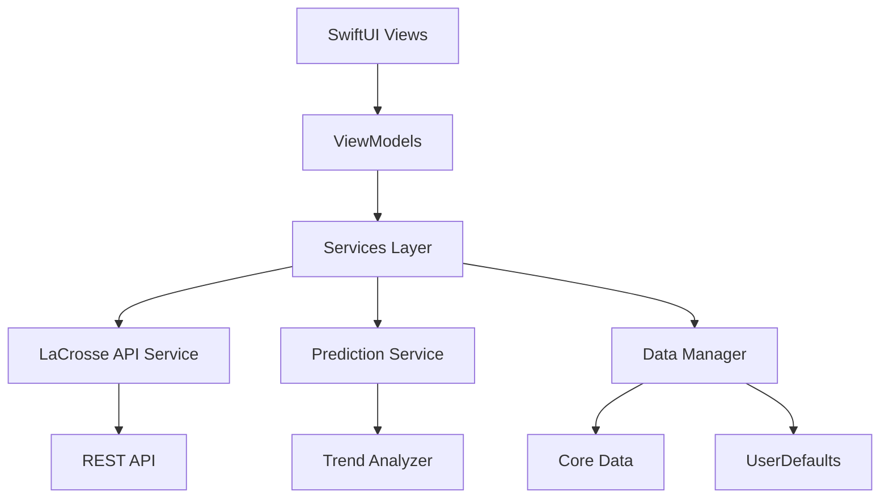
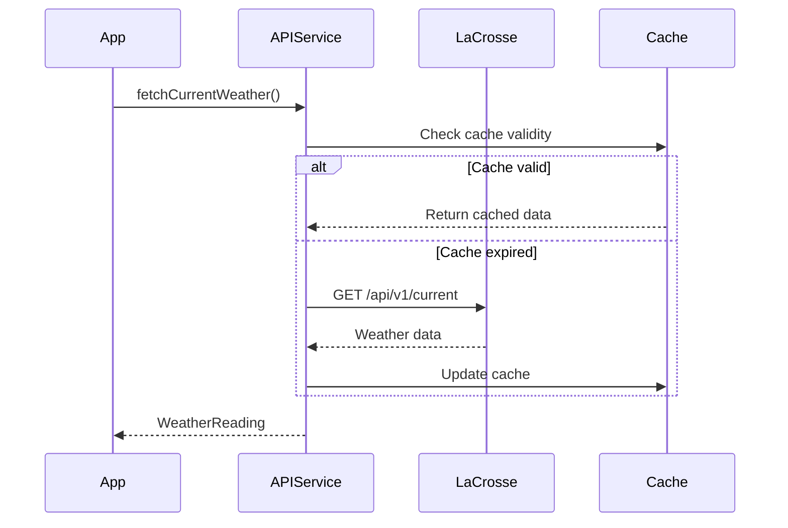
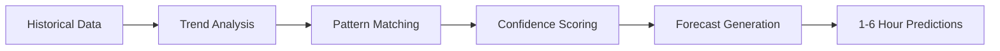
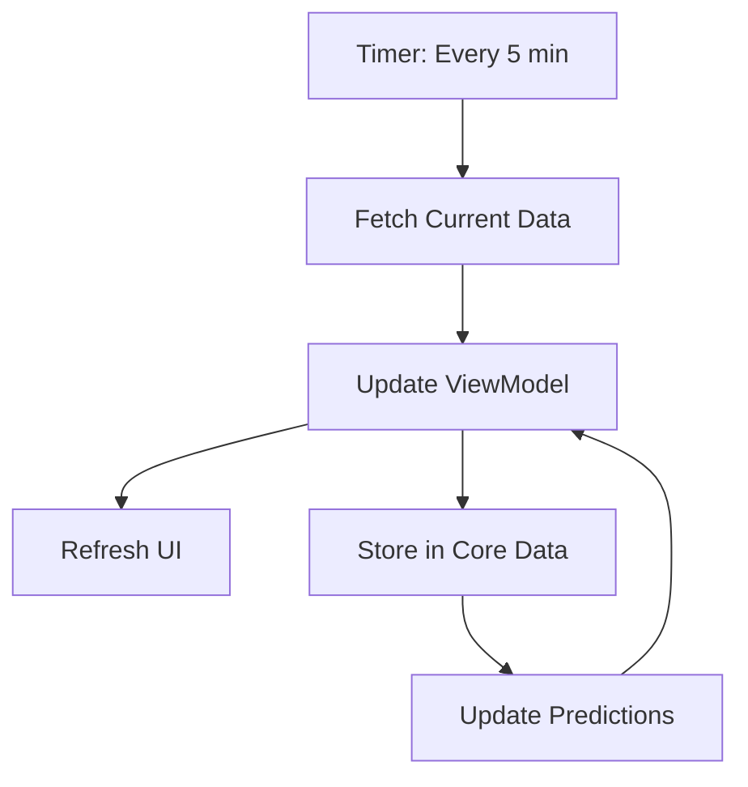

# LaCrosse Weather Station iOS App - Architecture Design

## Overview
A native iOS app built with SwiftUI that connects to a LaCrosse View weather station via REST API and provides short-term weather predictions (1-6 hours) based on sensor trend analysis.

## Technology Stack
- **Platform**: iOS 16.0+
- **Language**: Swift 5.9+
- **UI Framework**: SwiftUI
- **Architecture Pattern**: MVVM (Model-View-ViewModel)
- **Networking**: URLSession with async/await
- **Data Persistence**: UserDefaults for settings, Core Data for historical data
- **Prediction Engine**: Custom trend analysis algorithm

## App Architecture

### High-Level Architecture



### Layer Responsibilities

#### 1. View Layer (SwiftUI)
- **DashboardView**: Main screen showing current conditions
- **ForecastView**: 1-6 hour predictions with charts
- **SettingsView**: API configuration and preferences
- **HistoryView**: Historical data visualization
- **Components**: Reusable weather widgets and charts

#### 2. ViewModel Layer
- **DashboardViewModel**: Manages current weather state
- **ForecastViewModel**: Handles prediction data and updates
- **SettingsViewModel**: Configuration management
- **HistoryViewModel**: Historical data presentation

#### 3. Services Layer
- **WeatherAPIService**: REST API communication
- **PredictionService**: Weather prediction logic
- **DataManager**: Persistence operations
- **NotificationService**: Local notifications for alerts

#### 4. Model Layer
- **WeatherReading**: Current sensor data
- **WeatherForecast**: Prediction data structure
- **SensorData**: Individual sensor measurements
- **TrendData**: Calculated trends for prediction

## Data Models

### WeatherReading
```swift
struct WeatherReading: Codable, Identifiable {
    let id: UUID
    let timestamp: Date
    let temperature: Double
    let humidity: Double
    let pressure: Double
    let windSpeed: Double
    let windDirection: Int
    let rainfall: Double
    let uvIndex: Double?
}
```

### WeatherForecast
```swift
struct WeatherForecast: Identifiable {
    let id: UUID
    let generatedAt: Date
    let predictions: [HourlyPrediction]
    let confidence: Double
    let trendIndicators: TrendIndicators
}

struct HourlyPrediction {
    let hour: Int
    let temperature: TemperatureRange
    let humidity: HumidityRange
    let precipitationProbability: Double
    let conditions: WeatherCondition
}
```

### TrendIndicators
```swift
struct TrendIndicators {
    let temperatureTrend: Trend
    let pressureTrend: Trend
    let humidityTrend: Trend
    let windTrend: Trend
}

enum Trend {
    case rising, falling, stable
}
```

## API Integration

### LaCrosse View REST API

#### Endpoints
- `GET /api/v1/current` - Current weather data
- `GET /api/v1/history?hours=24` - Historical data
- `GET /api/v1/sensors` - Sensor status

#### Authentication
- API Key in header: `X-API-Key: {user_api_key}`
- Base URL configured in settings

#### Request Flow


## Prediction Algorithm

### Trend Analysis Approach

The prediction engine analyzes recent sensor data to identify trends and patterns:

#### 1. Data Collection
- Fetch last 6 hours of readings (every 5 minutes = 72 data points)
- Store in rolling window buffer

#### 2. Trend Calculation
```
Temperature Trend:
- Linear regression on last 2 hours
- Rate of change per hour
- Acceleration/deceleration detection

Pressure Trend:
- Critical for short-term prediction
- Falling pressure → potential precipitation
- Rising pressure → clearing conditions

Humidity Trend:
- Combined with temperature for dew point
- Rapid changes indicate weather shifts
```

#### 3. Prediction Generation


#### 4. Confidence Scoring
- High confidence (>80%): Stable trends, clear patterns
- Medium confidence (50-80%): Some variability
- Low confidence (<50%): Rapid changes, unstable conditions

### Prediction Rules

**Temperature Prediction:**
- Continue current trend with dampening factor
- Account for time of day (solar heating/cooling)
- Adjust for pressure changes

**Precipitation Probability:**
- Pressure drop >2 hPa/hour → High probability
- Humidity >85% + falling pressure → Very high
- Stable pressure + low humidity → Low probability

**Conditions Classification:**
- Clear: Pressure rising, humidity <60%
- Partly Cloudy: Stable pressure, moderate humidity
- Cloudy: Pressure falling slowly
- Rain Likely: Pressure falling rapidly, humidity >80%

## UI/UX Design

### Screen Layouts

#### Dashboard View
```
┌─────────────────────────┐
│   Current Conditions    │
│                         │
│      🌡️ 72°F           │
│      💧 65%             │
│      🌬️ 5 mph          │
│      📊 1013 hPa        │
│                         │
│   ─────────────────     │
│                         │
│   Next 6 Hours          │
│   [Forecast Cards]      │
│                         │
│   [View Details] →      │
└─────────────────────────┘
```

#### Forecast View
```
┌─────────────────────────┐
│   Hourly Forecast       │
│                         │
│   [Temperature Chart]   │
│   [Humidity Chart]      │
│   [Pressure Chart]      │
│                         │
│   Hour-by-Hour:         │
│   ├─ 1hr: 73°F ☁️      │
│   ├─ 2hr: 74°F ⛅      │
│   ├─ 3hr: 75°F ☀️      │
│   └─ ...                │
│                         │
│   Confidence: 85%       │
└─────────────────────────┘
```

### Design System

**Colors:**
- Primary: Blue (#007AFF)
- Background: System background
- Cards: Secondary system background
- Text: Primary/Secondary labels

**Typography:**
- Large Title: 34pt, Bold
- Title: 28pt, Regular
- Headline: 17pt, Semibold
- Body: 17pt, Regular

**Weather Icons:**
- SF Symbols for weather conditions
- Custom icons for trends (↑↓→)

## Data Flow

### Real-time Updates


### Offline Mode
- Cache last 24 hours of data
- Show cached predictions with timestamp
- Display "Offline" indicator
- Retry connection automatically

## Data Persistence

### UserDefaults
- API endpoint URL
- API key (encrypted in Keychain)
- User preferences (units, refresh interval)
- Last successful sync timestamp

### Core Data Schema
```
WeatherReadingEntity
├─ id: UUID
├─ timestamp: Date
├─ temperature: Double
├─ humidity: Double
├─ pressure: Double
├─ windSpeed: Double
├─ windDirection: Int16
└─ rainfall: Double

PredictionEntity
├─ id: UUID
├─ generatedAt: Date
├─ targetHour: Int16
├─ predictedTemp: Double
├─ confidence: Double
└─ actualTemp: Double? (for accuracy tracking)
```

## Error Handling

### Error Types
```swift
enum WeatherAppError: LocalizedError {
    case networkError(Error)
    case apiError(statusCode: Int, message: String)
    case invalidAPIKey
    case noDataAvailable
    case predictionFailed
    case dataCorrupted
}
```

### Error Recovery
- Automatic retry with exponential backoff
- Fallback to cached data
- User-friendly error messages
- Logging for debugging

## Security Considerations

1. **API Key Storage**: Use Keychain for secure storage
2. **HTTPS Only**: Enforce secure connections
3. **Input Validation**: Sanitize all API responses
4. **Certificate Pinning**: Optional for production

## Performance Optimization

1. **Lazy Loading**: Load historical data on demand
2. **Image Caching**: Cache weather icons
3. **Background Refresh**: Use Background Tasks framework
4. **Memory Management**: Limit historical data retention (7 days)

## Testing Strategy

### Unit Tests
- Model validation
- Prediction algorithm accuracy
- Trend calculation logic
- API response parsing

### Integration Tests
- API service communication
- Core Data operations
- Prediction generation pipeline

### UI Tests
- Navigation flow
- Settings configuration
- Data display accuracy

## Future Enhancements

1. **Widget Support**: Home screen widget with current conditions
2. **Watch App**: Apple Watch companion app
3. **Notifications**: Weather alerts and threshold notifications
4. **Multiple Stations**: Support for multiple weather stations
5. **Data Export**: CSV export of historical data
6. **Machine Learning**: Improve predictions with ML models
7. **Social Sharing**: Share weather conditions
8. **Siri Integration**: Voice commands for weather queries

## Development Phases

### Phase 1: Core Functionality (MVP)
- Basic API integration
- Current weather display
- Simple trend-based predictions
- Settings configuration

### Phase 2: Enhanced Predictions
- Advanced trend analysis
- Confidence scoring
- Historical data visualization
- Improved accuracy

### Phase 3: Polish & Features
- Refined UI/UX
- Notifications
- Widget support
- Performance optimization

### Phase 4: Advanced Features
- Machine learning predictions
- Multiple station support
- Watch app
- Data export