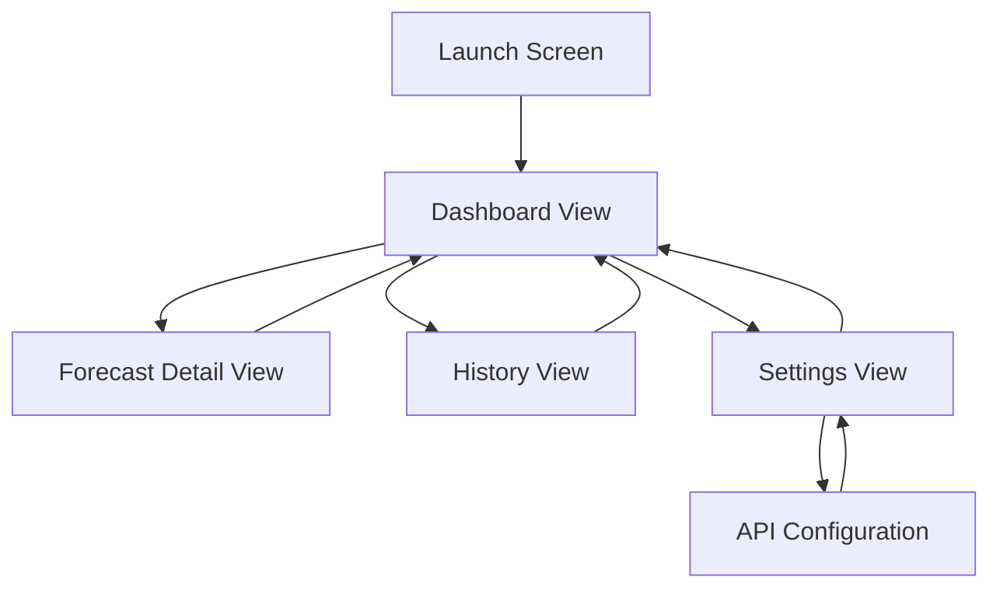

# LaCrosse Weather App - Wireframes & UI Specifications

## Screen Flow Diagram



## 1. Dashboard View (Main Screen)

### Layout Structure
```
┌─────────────────────────────────────┐
│  ☰  LaCrosse Weather        ⚙️     │ Navigation Bar
├─────────────────────────────────────┤
│                                     │
│         Current Conditions          │ Header Section
│         Last Updated: 2:45 PM       │
│                                     │
│  ┌─────────────────────────────┐  │
│  │                             │  │
│  │         🌡️ 72°F            │  │ Primary Card
│  │      Feels like 70°F        │  │
│  │                             │  │
│  │    ☁️ Partly Cloudy         │  │
│  │                             │  │
│  └─────────────────────────────┘  │
│                                     │
│  ┌───────┬───────┬───────┬───────┐ │
│  │  💧   │  🌬️  │  📊   │  🌧️  │ │ Metrics Grid
│  │  65%  │ 5mph  │1013hPa│  0in  │ │
│  │Humid. │ Wind  │Press. │ Rain  │ │
│  └───────┴───────┴───────┴───────┘ │
│                                     │
│  ─────────────────────────────────  │ Divider
│                                     │
│         📈 6-Hour Forecast          │ Section Header
│                                     │
│  ┌─────┬─────┬─────┬─────┬─────┐  │
│  │ 3PM │ 4PM │ 5PM │ 6PM │ 7PM │  │ Hourly Cards
│  │ ☀️  │ ⛅  │ ☁️  │ ☁️  │ 🌙  │  │ (Horizontal Scroll)
│  │ 73° │ 74° │ 75° │ 74° │ 72° │  │
│  │ ↑   │ ↑   │ →   │ ↓   │ ↓   │  │ Trend Arrows
│  └─────┴─────┴─────┴─────┴─────┘  │
│                                     │
│  [View Detailed Forecast →]        │ Action Button
│                                     │
│  ─────────────────────────────────  │
│                                     │
│  Prediction Confidence: 85% 🟢     │ Confidence Indicator
│  Based on 6 hours of data          │
│                                     │
└─────────────────────────────────────┘
```

### Component Specifications

**Navigation Bar:**
- Height: 44pt
- Left: Menu button (☰)
- Center: "LaCrosse Weather" title
- Right: Settings gear icon (⚙️)

**Current Conditions Card:**
- Corner radius: 16pt
- Padding: 20pt
- Shadow: 0 2 8 rgba(0,0,0,0.1)
- Background: System secondary background
- Large temperature: 48pt, Bold
- Condition icon: 64x64pt
- Condition text: 20pt, Medium

**Metrics Grid:**
- 4 columns, equal width
- Each cell: 80x80pt
- Icon: 32x32pt
- Value: 24pt, Bold
- Label: 12pt, Regular

**Hourly Forecast Cards:**
- Width: 70pt per card
- Height: 100pt
- Horizontal scroll
- Corner radius: 12pt
- Spacing: 8pt between cards

**Confidence Indicator:**
- Green (🟢): >80%
- Yellow (🟡): 50-80%
- Red (🔴): <50%

## 2. Forecast Detail View

### Layout Structure
```
┌─────────────────────────────────────┐
│  ←  6-Hour Forecast                 │ Navigation Bar
├─────────────────────────────────────┤
│                                     │
│  Generated: 2:45 PM                 │ Timestamp
│  Confidence: 85% 🟢                 │
│                                     │
│  ┌─────────────────────────────┐  │
│  │   Temperature Trend         │  │ Chart Section
│  │                             │  │
│  │   [Line Chart]              │  │
│  │   72° ─────╱────╲────       │  │
│  │        3PM 4PM 5PM 6PM      │  │
│  │                             │  │
│  └─────────────────────────────┘  │
│                                     │
│  ┌─────────────────────────────┐  │
│  │   Pressure Trend            │  │
│  │                             │  │
│  │   [Line Chart]              │  │
│  │   1013 ────────────╲        │  │
│  │        3PM 4PM 5PM 6PM      │  │
│  │                             │  │
│  └─────────────────────────────┘  │
│                                     │
│  ┌─────────────────────────────┐  │
│  │   Humidity Trend            │  │
│  │                             │  │
│  │   [Line Chart]              │  │
│  │   65% ─────╱────────        │  │
│  │        3PM 4PM 5PM 6PM      │  │
│  │                             │  │
│  └─────────────────────────────┘  │
│                                     │
│  ─────────────────────────────────  │
│                                     │
│  Hour-by-Hour Details               │ Section Header
│                                     │
│  ┌─────────────────────────────┐  │
│  │ 3:00 PM                     │  │
│  │ 🌡️ 73°F  💧 64%  🌬️ 6mph  │  │ Detail Cards
│  │ ☀️ Sunny                    │  │
│  │ Rain: 5%                    │  │
│  └─────────────────────────────┘  │
│                                     │
│  ┌─────────────────────────────┐  │
│  │ 4:00 PM                     │  │
│  │ 🌡️ 74°F  💧 63%  🌬️ 7mph  │  │
│  │ ⛅ Partly Cloudy            │  │
│  │ Rain: 10%                   │  │
│  └─────────────────────────────┘  │
│                                     │
│  [More hours...]                    │
│                                     │
└─────────────────────────────────────┘
```

### Component Specifications

**Charts:**
- Height: 180pt each
- Padding: 16pt
- Grid lines: Light gray
- Data line: Blue, 2pt width
- Animated on load

**Hour Detail Cards:**
- Full width minus 32pt padding
- Height: Auto (min 80pt)
- Corner radius: 12pt
- Margin: 8pt vertical
- Background: System secondary background

## 3. Settings View

### Layout Structure
```
┌─────────────────────────────────────┐
│  ←  Settings                        │ Navigation Bar
├─────────────────────────────────────┤
│                                     │
│  API Configuration                  │ Section Header
│  ┌─────────────────────────────┐  │
│  │ API Endpoint                │  │
│  │ [https://api.lacrosse...]   │  │ Text Field
│  └─────────────────────────────┘  │
│                                     │
│  ┌─────────────────────────────┐  │
│  │ API Key                     │  │
│  │ [••••••••••••••••••••]      │  │ Secure Field
│  └─────────────────────────────┘  │
│                                     │
│  [Test Connection]                  │ Button
│  ✓ Connected successfully           │ Status
│                                     │
│  ─────────────────────────────────  │
│                                     │
│  Display Preferences                │ Section Header
│  ┌─────────────────────────────┐  │
│  │ Temperature Unit            │  │
│  │ Fahrenheit          ›       │  │ Picker Row
│  └─────────────────────────────┘  │
│                                     │
│  ┌─────────────────────────────┐  │
│  │ Wind Speed Unit             │  │
│  │ MPH                 ›       │  │
│  └─────────────────────────────┘  │
│                                     │
│  ┌─────────────────────────────┐  │
│  │ Pressure Unit               │  │
│  │ hPa                 ›       │  │
│  └─────────────────────────────┘  │
│                                     │
│  ─────────────────────────────────  │
│                                     │
│  Update Settings                    │ Section Header
│  ┌─────────────────────────────┐  │
│  │ Refresh Interval            │  │
│  │ 5 minutes           ›       │  │
│  └─────────────────────────────┘  │
│                                     │
│  ┌─────────────────────────────┐  │
│  │ Background Updates          │  │
│  │                      [ON]   │  │ Toggle
│  └─────────────────────────────┘  │
│                                     │
│  ─────────────────────────────────  │
│                                     │
│  Data Management                    │ Section Header
│  ┌─────────────────────────────┐  │
│  │ Clear Cache                 │  │
│  │                         ›   │  │
│  └─────────────────────────────┘  │
│                                     │
│  ┌─────────────────────────────┐  │
│  │ Export Data                 │  │
│  │                         ›   │  │
│  └─────────────────────────────┘  │
│                                     │
│  ─────────────────────────────────  │
│                                     │
│  About                              │ Section Header
│  Version 1.0.0                      │
│  © 2024 Your Name                   │
│                                     │
└─────────────────────────────────────┘
```

### Component Specifications

**Text Fields:**
- Height: 44pt
- Corner radius: 8pt
- Background: Tertiary system background
- Padding: 12pt horizontal

**Buttons:**
- Height: 44pt
- Corner radius: 8pt
- Primary color background
- White text, 17pt Medium

**List Rows:**
- Height: 44pt
- Chevron right indicator
- Tap to navigate to detail

**Toggles:**
- Standard iOS toggle
- Aligned right

## 4. History View

### Layout Structure
```
┌─────────────────────────────────────┐
│  ←  History                         │ Navigation Bar
├─────────────────────────────────────┤
│                                     │
│  [24h] [7d] [30d]                   │ Time Range Tabs
│                                     │
│  ┌─────────────────────────────┐  │
│  │   Temperature History       │  │
│  │                             │  │
│  │   [Area Chart]              │  │ Chart Section
│  │   75° ────╱╲────╱╲──       │  │
│  │   70° ───╱  ╲──╱  ╲─       │  │
│  │   65° ──╱    ╲╱    ╲       │  │
│  │      12a  6a  12p  6p       │  │
│  │                             │  │
│  └─────────────────────────────┘  │
│                                     │
│  Statistics                         │ Section Header
│  ┌───────┬───────┬───────┬───────┐ │
│  │  Max  │  Min  │  Avg  │ Range │ │
│  │  78°F │  65°F │  72°F │  13°  │ │
│  └───────┴───────┴───────┴───────┘ │
│                                     │
│  ┌─────────────────────────────┐  │
│  │   Pressure History          │  │
│  │                             │  │
│  │   [Line Chart]              │  │
│  │                             │  │
│  └─────────────────────────────┘  │
│                                     │
│  ┌─────────────────────────────┐  │
│  │   Humidity History          │  │
│  │                             │  │
│  │   [Line Chart]              │  │
│  │                             │  │
│  └─────────────────────────────┘  │
│                                     │
│  [Export Data]                      │ Action Button
│                                     │
└─────────────────────────────────────┘
```

## 5. Loading & Error States

### Loading State
```
┌─────────────────────────────────────┐
│  LaCrosse Weather                   │
├─────────────────────────────────────┤
│                                     │
│                                     │
│                                     │
│           ⟳                         │ Spinner
│                                     │
│      Loading weather data...        │ Message
│                                     │
│                                     │
│                                     │
│                                     │
└─────────────────────────────────────┘
```

### Error State
```
┌─────────────────────────────────────┐
│  LaCrosse Weather                   │
├─────────────────────────────────────┤
│                                     │
│                                     │
│           ⚠️                        │ Error Icon
│                                     │
│      Unable to connect              │ Error Title
│                                     │
│  Please check your API settings     │ Error Message
│  and internet connection            │
│                                     │
│  [Retry]        [Settings]          │ Action Buttons
│                                     │
│                                     │
└─────────────────────────────────────┘
```

### Offline Mode
```
┌─────────────────────────────────────┐
│  ☰  LaCrosse Weather        ⚙️     │
│  📡 Offline - Showing cached data   │ Banner
├─────────────────────────────────────┤
│                                     │
│  [Cached weather data display]      │
│                                     │
│  Last updated: 1 hour ago           │ Timestamp
│                                     │
└─────────────────────────────────────┘
```

## Design Tokens

### Colors
```swift
Primary: #007AFF (iOS Blue)
Secondary: #5856D6 (iOS Purple)
Success: #34C759 (iOS Green)
Warning: #FF9500 (iOS Orange)
Error: #FF3B30 (iOS Red)

Background:
- Light: #FFFFFF
- Dark: #000000

Card Background:
- Light: #F2F2F7
- Dark: #1C1C1E

Text:
- Primary Light: #000000
- Primary Dark: #FFFFFF
- Secondary Light: #3C3C43 (60% opacity)
- Secondary Dark: #EBEBF5 (60% opacity)
```

### Typography
```swift
Large Title: 34pt, Bold
Title 1: 28pt, Regular
Title 2: 22pt, Regular
Title 3: 20pt, Regular
Headline: 17pt, Semibold
Body: 17pt, Regular
Callout: 16pt, Regular
Subheadline: 15pt, Regular
Footnote: 13pt, Regular
Caption 1: 12pt, Regular
Caption 2: 11pt, Regular
```

### Spacing
```swift
XXS: 4pt
XS: 8pt
S: 12pt
M: 16pt
L: 20pt
XL: 24pt
XXL: 32pt
```

### Corner Radius
```swift
Small: 8pt
Medium: 12pt
Large: 16pt
XLarge: 20pt
```

### Shadows
```swift
Small: 0 1 3 rgba(0,0,0,0.1)
Medium: 0 2 8 rgba(0,0,0,0.1)
Large: 0 4 16 rgba(0,0,0,0.15)
```

## Accessibility

### Dynamic Type Support
- All text scales with system font size
- Minimum touch target: 44x44pt
- Sufficient color contrast (WCAG AA)

### VoiceOver Labels
- All interactive elements have labels
- Charts have descriptive summaries
- Status indicators are announced

### Dark Mode
- Full dark mode support
- Automatic switching
- Optimized colors for both modes

## Animations

### Transitions
- Screen transitions: 0.3s ease-in-out
- Card appearances: 0.2s spring
- Chart animations: 0.5s ease-out

### Interactions
- Button press: Scale 0.95, 0.1s
- Toggle: 0.2s ease
- Pull to refresh: Standard iOS behavior

## Responsive Design

### iPhone SE (Small)
- Compact layouts
- Smaller font sizes
- Reduced padding

### iPhone Pro (Medium)
- Standard layouts
- Default font sizes
- Standard padding

### iPhone Pro Max (Large)
- Spacious layouts
- Larger font sizes
- Increased padding

### iPad (Tablet)
- Two-column layout
- Sidebar navigation
- Larger charts and cards